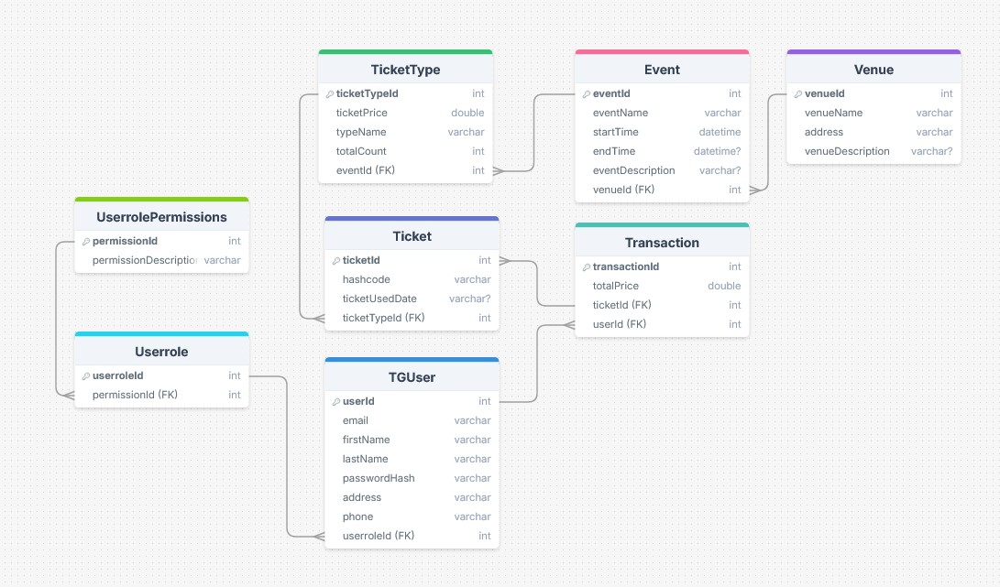

# TicketGuru

### Tiimi: Toom-Kaarel Kiisk, Nikolas Kataja, Aapo Kiljunen, Ville Kotilainen, Julius Luhtala, Kasperi Kuusanmäki

## Johdanto
TicketGuru on lipunmyyntijärjestelmä, joka mahdollistaa lippujen hallinnan ja myynnin tapahtumiin. Järjestelmä tukee lippujen myyntiä paikan päällä sekä tulevaisuudessa verkkokauppaa. Järjestelmän käyttäjäryhmiä ovat lipunmyyjät, tapahtumavastaavat ja asiakkaat. Järjestelmä helpottaa lipunmyynnin prosesseja aina tapahtuman luomisesta lippujen tarkistamiseen ovella.
### Toteutus- ja toimintaympäristö lyhyesti:
Palvelinpuolen teknologiat:
- Spring Boot -pohjainen backend REST-rajapinnan tarjoamiseen.
- MariaDB tietokantana tapahtuma-, lipputyyppi- ja käyttäjätietojen tallentamiseen.
- Palvelinajona Java 17 ympäristössä.
Käyttöliittymä:
- HTML/CSS/JavaScript käyttöliittymä (pääasiassa desktop-käytössä).
- QR-koodilukija lipun tarkistukseen.
Hosting-ympäristö:
- Järjestelmä ajetaan esimerkiksi paikallisessa palvelimessa tai pilvipalvelussa (Rahti).

## Järjestelmän määrittely
Lipunmyyntijärjestelmä suunnitellaan asiakkaalle, joka on lipputoimisto. Järjestelmän tarkoituksena on mahdollistaa lippujen myynti ja hallinta myyntipisteessa tapahtumiin, joita lipputoimisto järjestää. Järjestelmä palvelee lipunmyyjiä ja asiakkaita sekä lipputoimiston tapahtumavastaavia. Järjestelmän avulla tapahtumien järjestäjät voivat määritellä myytävät tapahtumat ja hallita lippujen myyntiä. Jatkokehityksenä järjestelmään lisätään verkkokauppa, jonka kautta asiakkaat voivat ostaa lippuja itsepalveluna.

Käyttäjäryhmät ja roolit
- Lipunmyyjä: Myy ja tulostaa lippuja asiakkaille myyntipisteessä. Hänellä on pääsy tapahtumakohtaisiin lippumääriin ja pystyy tulostamaan jäljellä olevia lippuja ennakkomyynnin päätyttyä myös ovella myytäväksi. Lipunmyyjä merkitsee käytetyt liput tarkistuksen yhteydessä.
- Tapahtumavastaava: Määrittää järjestelmään tapahtumat ja lippujen määrät. Hallinnoi myyntipisteitä ja seuraa lippujen myyntiä reaaliaikaisesti.
- Asiakas: Tulevaisuudessa voi ostaa lippuja verkkokaupan kautta itsepalveluna, sekä käyttää ostamansa liput tapahtumaan saapuessaan.

Käyttötapaukset (Use Case)
- Tapahtuman luonti – Tapahtumavastaava määrittää uuden tapahtuman, johon liput asetetaan myyntiin.
- Lipun myynti myyntipisteessä – Lipunmyyjä myy asiakkaalle lippuja ja tulostaa ne.
- Lipun tarkastus ja käyttöön merkitseminen – Ovenvartija tarkastaa asiakkaan lipun ovella ja merkitsee sen käytetyksi.
- Lippujen tulostus ovelta myytäväksi – Lipunmyyjä tulostaa ennakkomyynnin jälkeen jäljellä olevat liput ovella myyntiä varten.
- Verkkokaupan lipun ostaminen (Jatkokehitys) – Asiakas ostaa liput itse verkkokaupan kautta.
- <<<<<<< Development

=======
Käyttäjätarinat

-Myyjänä haluan, että jo olleet tapahtumat eivät näy myyntinäkymässä, mutta voin silti tarvittaessa etsiä myös vanhoja tapahtumia.
-Myyjänä haluan lisätä tapahtumia järjestelmään.
-Myyjänä haluan asettaa myytävien lippujen määrät sekä hinnat.
-Myyjänä haluan pystyä muuttamaan hintoja ostajan perusteella (esim norm, opiskelija ja eläke).
-Myyjänä haluan muokata tapahtumaa (esim kuvaa, päivää ja lokaatiota).
-Myyjänä haluan järjestelmän luovan jokaiselle lipulle uniikin ID:n.
-Myyjänä haluan saada nähdä myyntiraportin helposti.
-Asiakkaana haluan mahdollisuuden tulostaa minun ostamat liput
-Lipuntarkastajana haluan pystyä tarkastamaan liput ja niiden uniikit ID:t ovella.

## Käyttöliittymä

## Tietokanta

## Tietohakemisto

### _Event_
> _Event-taulu sisältää tapahtuman tiedot._
>
> Kenttä | Tyyppi | Kuvaus
> ------ | ------ | ------
> eventId | int PK | Tapahtuman id
> eventName | varchar | Tapahtuman nimi
> startTime | timestamp | Tapahtuman aloitus pvm
> endTime | timestamp | Tapahtuman lopetus pvm
> eventDescription | varchar | Tapahtuman kuvaus
> venueId | int FK | Tapahtumapaikka, viittaus [Venue](#Venue)-tauluun

### _Venue_
> _Venue-taulu sisältää tapahtumapaikan tiedot._
>
> Kenttä | Tyyppi | Kuvaus
> ------ | ------ | ------
> venueId | int PK | Tapahtumapaikan id
> venueName | varchar | Tapahtumapaikan nimi
> address | varchar | Tapahtumapaikan osoite
> venueDescription | varchar | Tapahtumapaikan kuvaus

 ### _Ticket_
> _Ticket-taulu sisältää lipun tiedot._
>
> Kenttä | Tyyppi | Kuvaus
> ------ | ------ | ------
> ticketId | int PK | Lipun id
> hashcode | varchar | Lipun koodi
> price | int | Lipun hinta
> ticketUsedDate | timestamp | Lipun käyttö pvm
> ticketTypeId | int FK | Tapahtuma, viittaus [TicketType](#TicketType)-tauluun

 ### _TicketType_
> _TicketType-taulu sisältää lipputyypin tiedot._
>
> Kenttä | Tyyppi | Kuvaus
> ------ | ------ | ------
> ticketTypeId | int PK | Lipputyypin id
> ticketPrice | int | Lipun hinta
> typeName | varchar | Lipputyypin nimi
> totalCount | int | Lipputyypin määrä
> eventId | int FK | Tapahtuma, viittaus [Event](#Event)-tauluun

 ### _Transaction_
> _Transaction-taulu sisältää ostotapahtuman tiedot._
>
> Kenttä | Tyyppi | Kuvaus
> ------ | ------ | ------
> transactionId | int PK | Ostotapahtuman id
> transactionDate | timestamp | Ostotapahtuman pvm
> totalSum | int | Ostotapahtuman hinta
> succeeded | boolean | Ostotapahtuman status
> userId | int FK | Käyttäjä, viittaus [TGUser](#TGUser)-tauluun
> ticketId | int FK | Lippu, viittaus [Ticket](#Ticket)-tauluun

 ### _TGUser_
> _TGUser-taulu sisältää käyttäjän tiedot._
>
> Kenttä | Tyyppi | Kuvaus
> ------ | ------ | ------
> userId | int PK | Käyttäjän id
> email | varchar | Käyttäjän sähköposti
> firstName | varchar | Käyttäjän etunimi
> lastName | varchar | Käyttäjän sukunimi
> password | varchar | Käyttäjän salasana
> address | varchar | Käyttäjän osoite
> phone | int | Käyttäjän puhelinnumero
> userroleId | int FK | Rooli, viittaus [Userrole](#Userrole)-tauluun

 ### _Userrole_
> _Userrole-taulu sisältää roolin tiedot._
>
> Kenttä | Tyyppi | Kuvaus
> ------ | ------ | ------
> userroleId | int PK | Roolin id
> permissionsId | int FK | Käyttöoikeuden id, viittaus [UserrolePermissions](#UserrolePermissions)-tauluun

### _UserrolePermissions_
> _UserrolePermissions-taulu sisältää käyttöoikeuksien tiedot._

> Kenttä | Tyyppi | Kuvaus
> ------ | ------ | ------
> permissionId | int PK | Käyttöoikeuden id
> permissionDescription | varchar | Käyttöoikeuden kuvaus

## Tekninen kuvaus
### Frontend (Client):

 - Käyttäjät (admin, lipunmyyjä) käyttävät järjestelmää verkkoselaimen kautta.
 - Lipputarkistus ja myynticlientit ovat yksinkertaisia web-sivuja.
 - Käytetään HTML:ää, CSS:ää ja JavaScriptiä.

###Teknologiat:
 - HTML, CSS, ja JavaScript käytetään yksinkertaisten ja responsiivisten käyttöliittymien toteutukseen.
 - QR-koodin lukeminen: html5-qrcode-kirjasto mahdollistaa kameran käyttämisen lippujen QR-koodien lukemiseen.

###Toiminnot
 
### Backend (Palvelin):

 - Spring Boot -sovellus: Sisältää liiketoimintalogiikan, tietokantayhteydet ja REST-rajapinnat.
 - Ajetaan pilvipalvelussa.

### Yhteydet ja Vuorovaikutus:

 - Frontend kommunikoi backendin kanssa HTTPS:n yli REST-rajapintojen avulla.
 - Rajapintojen avulla frontend pystyy hallitsemaan lippuja, tapahtumia, ja myyntiraportteja.
 - Backend käyttää JDBC:tä tietokantayhteyksissä.
 - JDBC-kirjastolla toteutetut tietokantayhteydet mahdollistavat tietojen tallennuksen ja haun.

### Käytetyt Teknologiat:

  - Backend: Java, Spring Boot, Spring Security.
  - Tietokanta: H2 (kehityksessä), mariaDB (tuotannossa).
  - Autentikointi: Spring Security (HTTP Basic Authentication).
  - Frontend: HTML, CSS, JavaScript, html5-qrcode-kirjasto.
  - Build-työkalu: Maven.
  - Versionhallinta: Git (GitHub-repository).

### Tietoturva:
#### Autentikointi ja Autorisointi:

  - HTTP Basic Authentication: Käyttäjänimi ja salasana tarkistetaan tietokannasta.
  - Roolipohjainen käyttöoikeus: Adminilla on pääsy kaikkiin toimintoihin, lipunmyyjällä vain tapahtumien myyntiin ja lippujen tarkastukseen.
  
#### CSRF-suojaus:

  - Tuotannossa käytetään CSRF-tokeneita.

#### Salasanat:

  - Hashataan ja suojataan käyttäen BCrypt-algoritmia.
  
#### Yhteydet:

  - Kaikki liikenne kulkee HTTPS-yhteyksien kautta, mikä varmistaa datan salauksen ja suojaa tietojen välitystä.

## Kehitys- ja tuotantoympäristöt:
 ### Kehitysympärittö
 - Spring Boot -sovellus paikallisesti kehittäjien koneilla.
 - H2-tietokanta simuloimassa tuotantodataa.
 - Frontend-testaukset suoritetaan paikallisilla selaimilla.

### Tuotantoympäristö:
 - Spring Boot -sovellus deployattu Rahti-pilvipalveluun.
 - MariaDB toimii pilvessä tuotantodatan tallentamiseen.

### REST-rajapinnan kuvaus
[REST-rajapinta](./documents/restapidocs/)
