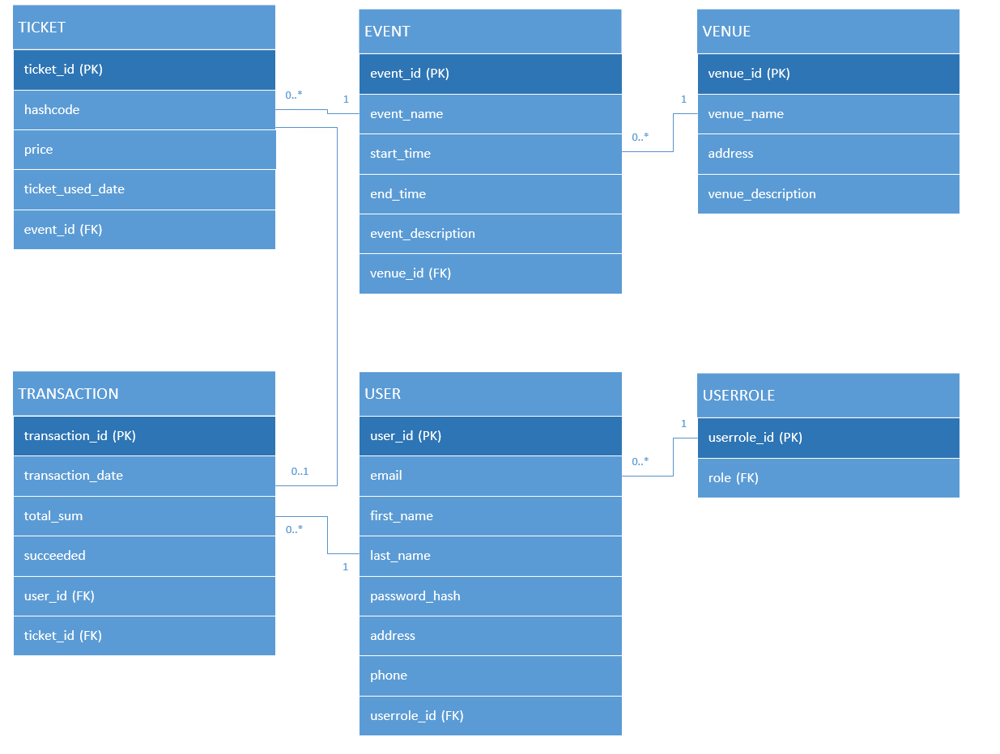

# TicketGuru

### Tiimi: Toom-Kaarel Kiisk, Nikolas Kataja, Aapo Kiljunen, Ville Kotilainen, Julius Luhtala, Kasperi Kuusanmäki

## Johdanto

### Kuvaus
Asiakkaamme on lipputoimisto, joka on tilannut lipunmyyntijärjestelmän lippujen myymiseen myyntipisteessään. Toimisto voi määritellä järjestelmään tapahtumat, joihin lippuja myydään. 

Lipunmyyntipisteessä lipunmyyjä myy ja tulostaa asiakkaalle liput. Ennakkomyynnin loputtua loput liput tulostetaan ovella myytäviksi. Lipuissa on ovella helposti tarkastettava koodi, jolla lippu voidaan ovella merkitä käytetyksi.

Jatkokehityksessä järjestelmään aiotaan lisätä verkkokauppa, jolla asiakkaat voivat itse ostaa lippuja.

Järjestelmän tarkoitus ja tiivis kuvaus siitä, mistä on kyse ja kenelle järjestelmä on tarkoitettu.
### Toteutus- ja toimintaympäristö lyhyesti:
- Palvelinpuolen ratkaisut ja teknologiat (esim. palvelinteknologia, mikä tietokantajärjestelmä on käytössä)
- Käyttöliittymäratkaisut ja teknologiat (esim. päätelaitteet: puhelin, täppäri, desktop)
## Järjestelmän määrittely
Lipunmyyntijärjestelmä suunnitellaan asiakkaalle, joka on lipputoimisto. Järjestelmän tarkoituksena on mahdollistaa lippujen myynti ja hallinta myyntipisteessa tapahtumiin, joita lipputoimisto järjestää. Järjestelmä palvelee lipunmyyjiä ja asiakkaita sekä lipputoimiston tapahtumavastaavia. Järjestelmän avulla tapahtumien järjestäjät voivat määritellä myytävät tapahtumat ja hallita lippujen myyntiä. Jatkokehityksenä järjestelmään lisätään verkkokauppa, jonka kautta asiakkaat voivat ostaa lippuja itsepalveluna.

Käyttäjäryhmät ja roolit
- Lipunmyyjä: Myy ja tulostaa lippuja asiakkaille myyntipisteessä. Hänellä on pääsy tapahtumakohtaisiin lippumääriin ja pystyy tulostamaan jäljellä olevia lippuja ennakkomyynnin päätyttyä myös ovella myytäväksi. Lipunmyyjä merkitsee käytetyt liput tarkistuksen yhteydessä.
- Tapahtumavastaava: Määrittää järjestelmään tapahtumat ja lippujen määrät. Hallinnoi myyntipisteitä ja seuraa lippujen myyntiä reaaliaikaisesti.
- Asiakas: Tulevaisuudessa voi ostaa lippuja verkkokaupan kautta itsepalveluna, sekä käyttää ostamansa liput tapahtumaan saapuessaan.

Käyttötapaukset (Use Case)
- Tapahtuman luonti – Tapahtumavastaava määrittää uuden tapahtuman, johon liput asetetaan myyntiin.
- Lipun myynti myyntipisteessä – Lipunmyyjä myy asiakkaalle lippuja ja tulostaa ne.
- Lipun tarkastus ja käyttöön merkitseminen – Ovenvartija tarkastaa asiakkaan lipun ovella ja merkitsee sen käytetyksi.
- Lippujen tulostus ovelta myytäväksi – Lipunmyyjä tulostaa ennakkomyynnin jälkeen jäljellä olevat liput ovella myyntiä varten.
- Verkkokaupan lipun ostaminen (Jatkokehitys) – Asiakas ostaa liput itse verkkokaupan kautta.
- <<<<<<< Development

=======
Käyttäjätarinat

-Myyjänä haluan, että jo olleet tapahtumat eivät näy myyntinäkymässä, mutta voin silti tarvittaessa etsiä myös vanhoja tapahtumia.
-Myyjänä haluan lisätä tapahtumia järjestelmään.
-Myyjänä haluan asettaa myytävien lippujen määrät sekä hinnat.
-Myyjänä haluan pystyä muuttamaan hintoja ostajan perusteella (esim norm, opiskelija ja eläke).
-Myyjänä haluan muokata tapahtumaa (esim kuvaa, päivää ja lokaatiota).
-Myyjänä haluan järjestelmän luovan jokaiselle lipulle uniikin ID:n.
-Myyjänä haluan saada nähdä myyntiraportin helposti.
-Asiakkaana haluan mahdollisuuden tulostaa minun ostamat liput
-Lipuntarkastajana haluan pystyä tarkastamaan liput ja niiden uniikit ID:t ovella.

## Käyttöliittymä
Esitetään käyttöliittymän tärkeimmät (vain ne!) näkymät sekä niiden väliset siirtymät käyttöliittymäkaaviona.

Jos näkymän tarkoitus ei ole itsestään selvä, se pitää kuvata lyhyesti.

## Tietokanta

## Tietohakemisto

### _Event_
> _Event-taulu sisältää tapahtuman tiedot._
>
> Kenttä | Tyyppi | Kuvaus
> ------ | ------ | ------
> eventId | int PK | Tapahtuman id
> eventName | varchar | Tapahtuman nimi
> startTime | timestamp | Tapahtuman aloitus pvm
> endTime | timestamp | Tapahtuman lopetus pvm
> eventDescription | varchar | Tapahtuman kuvaus
> venue_id | int FK | Tapahtumapaikka, viittaus [Venue](#Venue)-tauluun

### _Venue_
> _Venue-taulu sisältää tapahtumapaikan tiedot._
>
> Kenttä | Tyyppi | Kuvaus
> ------ | ------ | ------
> venueId | int PK | Tapahtumapaikan id
> venueName | varchar | Tapahtumapaikan nimi
> address | varchar | Tapahtumapaikan osoite
> venueDescription | varchar | Tapahtumapaikan kuvaus

 ### _Ticket_
> _Ticket-taulu sisältää lipun tiedot._
>
> Kenttä | Tyyppi | Kuvaus
> ------ | ------ | ------
> ticketId | int PK | Lipun id
> hashcode | int | Lipun koodi
> price | int | Lipun hinta
> ticketUsedDate | timestamp | Lipun käyttö pvm
> ticketTypeId | int FK | Tapahtuma, viittaus [TicketType](#TicketType)-tauluun

 ### _TicketType_
> _Ticket-taulu sisältää lipun tiedot._
>
> Kenttä | Tyyppi | Kuvaus
> ------ | ------ | ------
> ticketId | int PK | Lipun id
> hashcode | int | Lipun koodi
> price | int | Lipun hinta
> eventId | int FK | Tapahtuma, viittaus [Event](#Event)-tauluun

 ### _Transaction_
> _Transaction-taulu sisältää ostotapahtuman tiedot._
>
> Kenttä | Tyyppi | Kuvaus
> ------ | ------ | ------
> transactionId | int PK | Ostotapahtuman id
> transactionDate | timestamp | Ostotapahtuman pvm
> totalSum | int | Ostotapahtuman hinta
> succeeded | boolean | Ostotapahtuman status
> TGUserId | int FK | Käyttäjä, viittaus [TGUser](#TGUser)-tauluun
> ticketId | int FK | Lippu, viittaus [Ticket](#Ticket)-tauluun

 ### _TGUser_
> _TGUser-taulu sisältää käyttäjän tiedot._
>
> Kenttä | Tyyppi | Kuvaus
> ------ | ------ | ------
> userId | int PK | Käyttäjän id
> email | varchar | Käyttäjän sähköposti
> firstName | varchar | Käyttäjän etunimi
> lastName | varchar | Käyttäjän sukunimi
> password | varchar | Käyttäjän salasana
> address | varchar | Käyttäjän osoite
> phone | int | Käyttäjän puhelinnumero
> userroleId | int FK | Rooli, viittaus [Userrole](#Userrole)-tauluun

 ### _Userrole_
> _Userrole-taulu sisältää roolin tiedot._
>
> Kenttä | Tyyppi | Kuvaus
> ------ | ------ | ------
> userroleId | int PK | Roolin id
> role | varchar FK | Käyttäjän sähköposti

### _UserrolePermissions_
> _UserrolePermissions-taulu sisältää roolin tiedot._

> Kenttä | Tyyppi | Kuvaus
> ------ | ------ | ------
> permissionId | int PK | Käyttöoikeuden id
> permissionDescription | varchar | Käyttöoikeuden kuvaus

## Tekninen kuvaus
Teknisessä kuvauksessa esitetään järjestelmän toteutuksen suunnittelussa tehdyt tekniset ratkaisut, esim.

Missä mikäkin järjestelmän komponentti ajetaan (tietokone, palvelinohjelma) ja komponenttien väliset yhteydet (vaikkapa tähän tyyliin: https://security.ufl.edu/it-workers/risk-assessment/creating-an-information-systemdata-flow-diagram/)
Palvelintoteutuksen yleiskuvaus: teknologiat, deployment-ratkaisut yms.
Keskeisten rajapintojen kuvaukset, esimerkit REST-rajapinta. Tarvittaessa voidaan rajapinnan käyttöä täsmentää UML-sekvenssikaavioilla.
Toteutuksen yleisiä ratkaisuja, esim. turvallisuus.

### Tämän lisäksi

ohjelmakoodin tulee olla kommentoitua
luokkien, metodien ja muuttujien tulee olla kuvaavasti nimettyjä ja noudattaa johdonmukaisia nimeämiskäytäntöjä
ohjelmiston pitää olla organisoitu komponentteihin niin, että turhalta toistolta vältytään
Testaus
Tässä kohdin selvitetään, miten ohjelmiston oikea toiminta varmistetaan testaamalla projektin aikana: millaisia testauksia tehdään ja missä vaiheessa. Testauksen tarkemmat sisällöt ja testisuoritusten tulosten raportit kirjataan erillisiin dokumentteihin.

Tänne kirjataan myös lopuksi järjestelmän tunnetut ongelmat, joita ei ole korjattu.

## Asennustiedot
Järjestelmän asennus on syytä dokumentoida kahdesta näkökulmasta:

järjestelmän kehitysympäristö: miten järjestelmän kehitysympäristön saisi rakennettua johonkin toiseen koneeseen

järjestelmän asentaminen tuotantoympäristöön: miten järjestelmän saisi asennettua johonkin uuteen ympäristöön.

Asennusohjeesta tulisi ainakin käydä ilmi, miten käytettävä tietokanta ja käyttäjät tulee ohjelmistoa asentaessa määritellä (käytettävä tietokanta, käyttäjätunnus, salasana, tietokannan luonti yms.).

## Käynnistys- ja käyttöohje
Tyypillisesti tässä riittää kertoa ohjelman käynnistykseen tarvittava URL sekä mahdolliset kirjautumiseen tarvittavat tunnukset. Jos järjestelmän käynnistämiseen tai käyttöön liittyy joitain muita toimenpiteitä tai toimintajärjestykseen liittyviä asioita, nekin kerrotaan tässä yhteydessä.

Usko tai älä, tulet tarvitsemaan tätä itsekin, kun tauon jälkeen palaat järjestelmän pariin !
